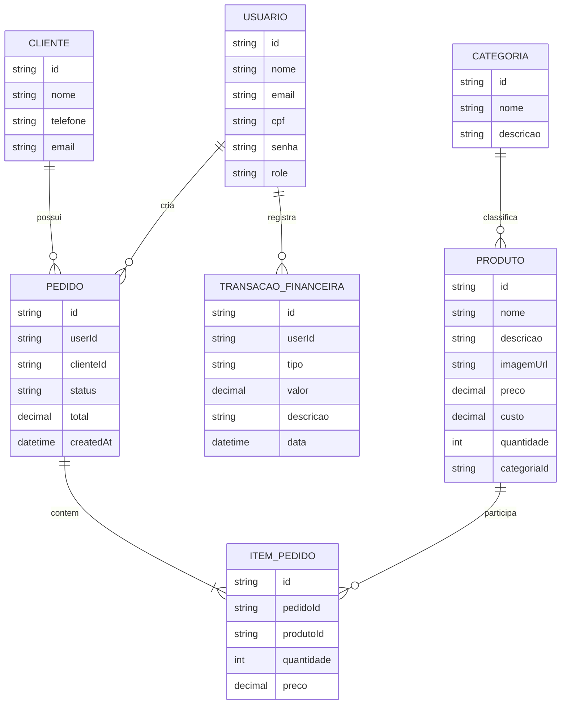

# 02 - DER (Diagrama Entidade Relacionamento)

## 1. Visao geral
O modelo de dados da aplicacao foi organizado para suportar autenticacao, catalogo de produtos, fluxo de pedidos e apoio financeiro.

## 2. Entidades principais
- Usuario
- Categoria
- Produto
- Cliente
- Pedido
- ItemPedido
- TransacaoFinanceira

## 3. Relacionamentos
- Usuario 1:N Pedido
- Cliente 1:N Pedido (opcional no pedido)
- Categoria 1:N Produto
- Pedido 1:N ItemPedido
- Produto 1:N ItemPedido
- Usuario 1:N TransacaoFinanceira

## 4. DER em Mermaid

## 5. Regras de negocio associadas ao modelo
- Produto deve ter nome e preco validos.
- Item de pedido deve ter quantidade positiva.
- Criacao de pedido deve validar estoque do produto.
- Upload de foto deve validar extensao e tamanho.
