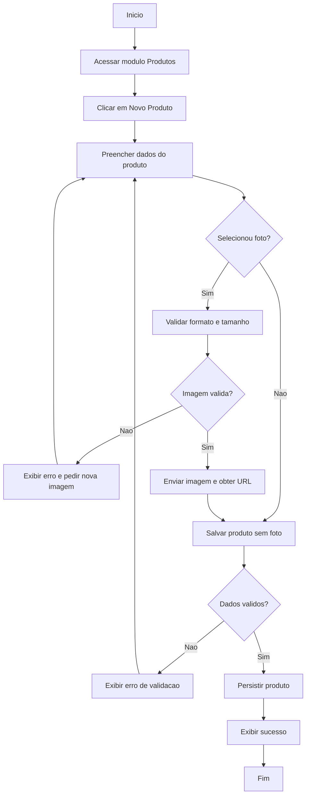
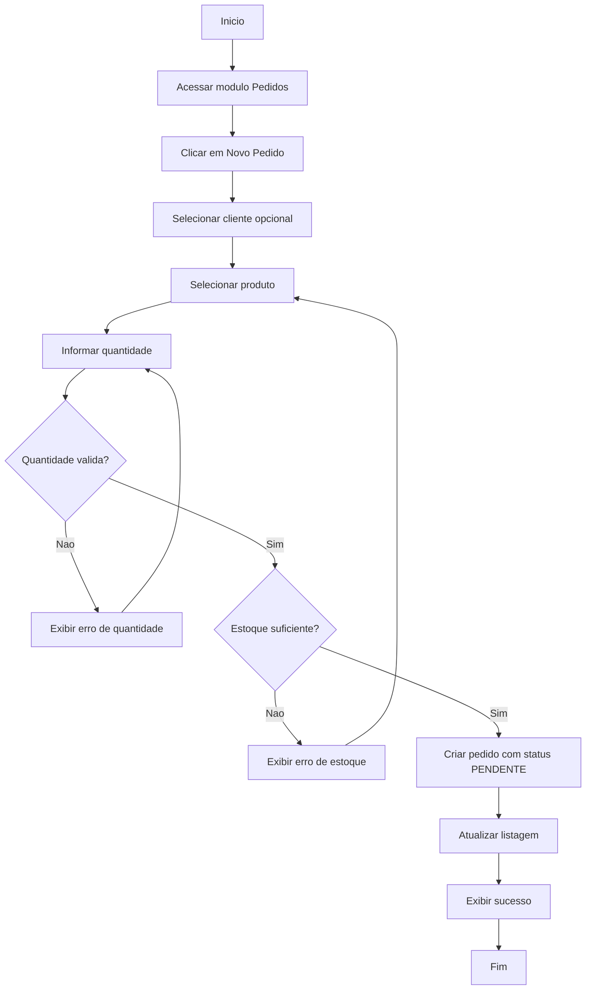

# 05 - Diagramas de Atividades

## Atividade 1 - Cadastro de produto com foto

```mermaid
flowchart TD
    A[Inicio] --> B[Acessar modulo Produtos]
    B --> C[Clicar em Novo Produto]
    C --> D[Preencher dados do produto]
    D --> E{Selecionou foto?}
    E -- Nao --> H[Salvar produto sem foto]
    E -- Sim --> F[Validar formato e tamanho]
    F --> G{Imagem valida?}
    G -- Nao --> C1[Exibir erro e pedir nova imagem]
    C1 --> D
    G -- Sim --> I[Enviar imagem e obter URL]
    I --> H
    H --> J{Dados validos?}
    J -- Nao --> K[Exibir erro de validacao]
    K --> D
    J -- Sim --> L[Persistir produto]
    L --> M[Exibir sucesso]
    M --> N[Fim]
```

## Atividade 2 - Criacao de pedido

```mermaid
flowchart TD
    A[Inicio] --> B[Acessar modulo Pedidos]
    B --> C[Clicar em Novo Pedido]
    C --> D[Selecionar cliente opcional]
    D --> E[Selecionar produto]
    E --> F[Informar quantidade]
    F --> G{Quantidade valida?}
    G -- Nao --> H[Exibir erro de quantidade]
    H --> F
    G -- Sim --> I{Estoque suficiente?}
    I -- Nao --> J[Exibir erro de estoque]
    J --> E
    I -- Sim --> K[Criar pedido com status PENDENTE]
    K --> L[Atualizar listagem]
    L --> M[Exibir sucesso]
    M --> N[Fim]
```
