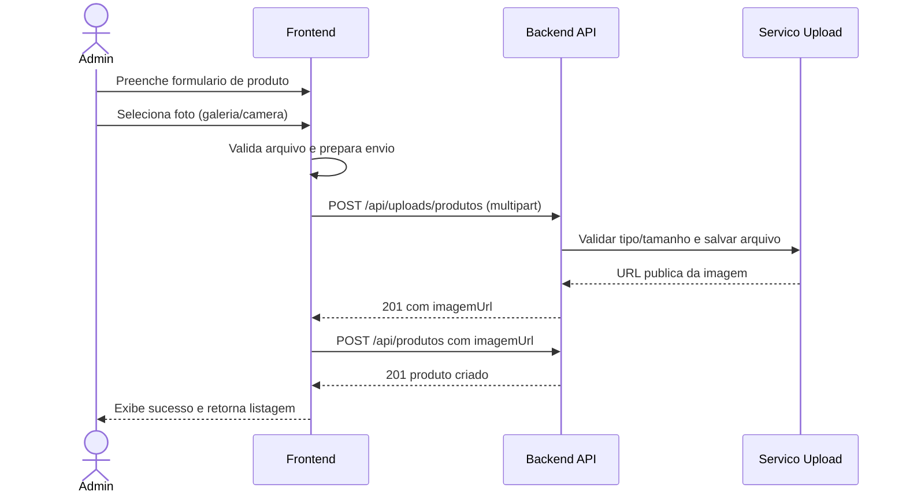
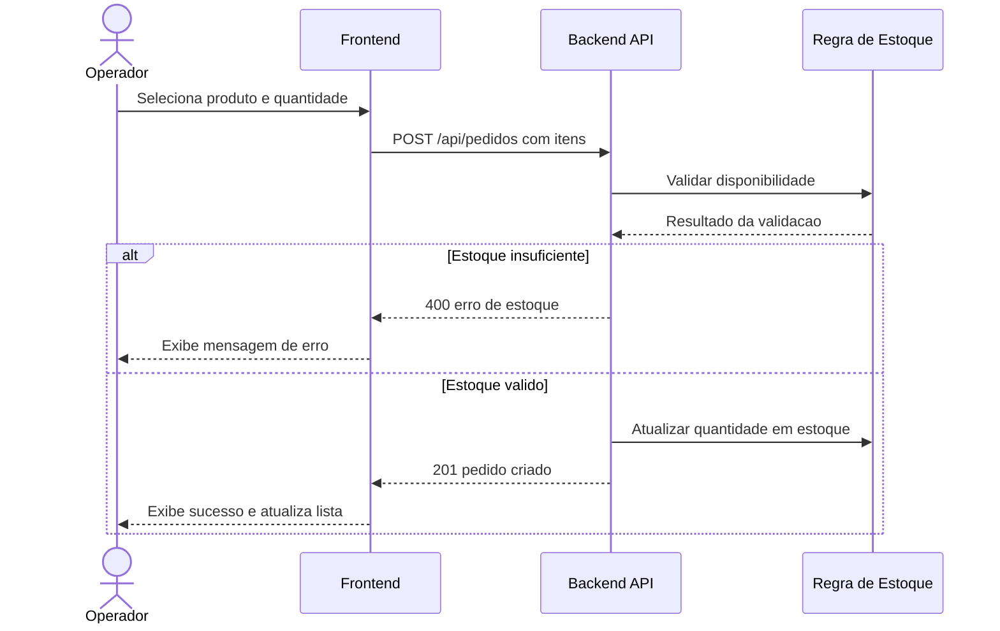

# 06 - Diagramas de Sequencia

## Sequencia 1 - Upload de foto e cadastro de produto

```mermaid
sequenceDiagram
    actor Admin
    participant Frontend
    participant API as Backend API
    participant Upload as Servico Upload

    Admin->>Frontend: Preenche formulario de produto
    Admin->>Frontend: Seleciona foto (galeria/camera)
    Frontend->>Frontend: Valida arquivo e prepara envio
    Frontend->>API: POST /api/uploads/produtos (multipart)
    API->>Upload: Validar tipo/tamanho e salvar arquivo
    Upload-->>API: URL publica da imagem
    API-->>Frontend: 201 com imagemUrl
    Frontend->>API: POST /api/produtos com imagemUrl
    API-->>Frontend: 201 produto criado
    Frontend-->>Admin: Exibe sucesso e retorna listagem
```

## Sequencia 2 - Criacao de pedido

```mermaid
sequenceDiagram
    actor Operador
    participant Frontend
    participant API as Backend API
    participant Estoque as Regra de Estoque

    Operador->>Frontend: Seleciona produto e quantidade
    Frontend->>API: POST /api/pedidos com itens
    API->>Estoque: Validar disponibilidade
    Estoque-->>API: Resultado da validacao
    alt Estoque insuficiente
        API-->>Frontend: 400 erro de estoque
        Frontend-->>Operador: Exibe mensagem de erro
    else Estoque valido
        API->>Estoque: Atualizar quantidade em estoque
        API-->>Frontend: 201 pedido criado
        Frontend-->>Operador: Exibe sucesso e atualiza lista
    end
```
